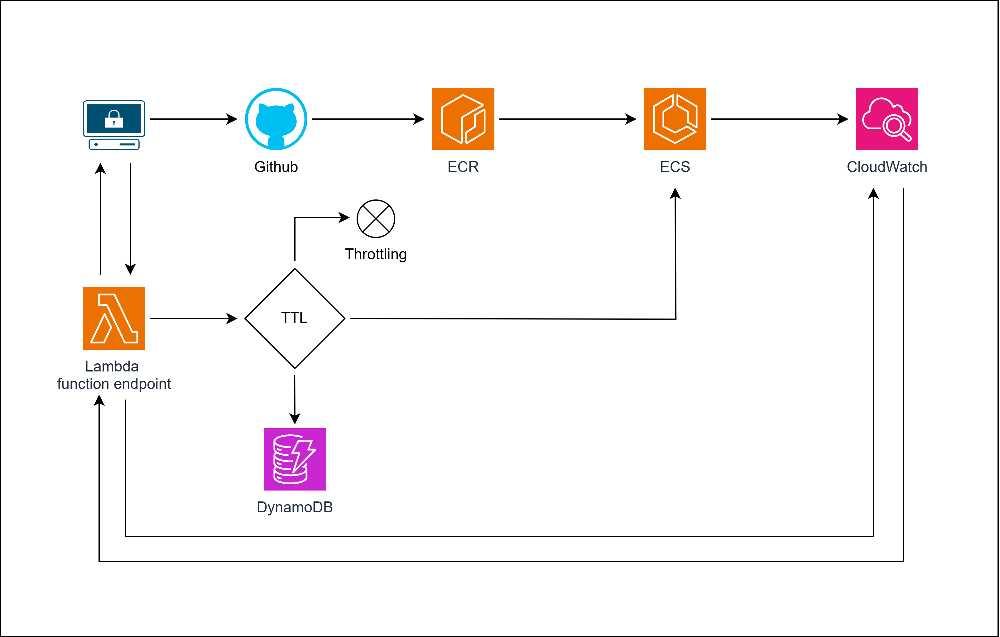

# 🚀 Serverless ECS Task Runner with Lambda Rate Limiting

## WHY CUSTOM THROTTLING (and why NOT just API Gateway)?

When you expose your Lambda via a Public Function URL,  
anyone with the link can launch containers and trigger your infrastructure.

To avoid surprise billing and uncontrolled usage,  
this project demonstrates a custom throttling approach.

- **Cooldown:** Each unique URL can be processed only **once every 3 minutes** (`1 request per 3 minutes`).
- If you try more often, you'll receive a clear `429 Too Many Requests` error.

---

### Why Not Just API Gateway Throttling?

- **API Gateway** offers built-in throttling, but  
  **Lambda Function URLs** (PublicLink) do **not** have native throttling.
- For flexibility and demo purposes, I used Lambda PublicLink.
- Public endpoints need extra care to prevent abuse and unexpected costs.

---

### Why DynamoDB TTL (not just API Gateway, Redis, or S3)?

- **DynamoDB TTL** provides:
  - Flexible, per-resource or per-user limits (by URL, IP, or any parameter)
  - Scalable, cheap, fully serverless, with no cold starts
  - Easy to extend with custom logic: group quotas, rolling limits, advanced scenarios
- **API Gateway** throttling is the best option for traditional REST APIs,  
  but here we wanted to try custom logic and more interesting scenarios.
- **Note:** If you just want a simple, robust rate limit for an API, use API Gateway.  
  If you need more flexibility, DynamoDB is a strong serverless alternative.

---

### Lambda Concurrency: Extra Anti-Spam Protection

To further **prevent spamming and accidental parallel execution**,  
**Lambda concurrency is limited** at the function level.  
This ensures that even if multiple requests are made,  
**no more than X** containers can run in parallel.

---

## 🏃‍♂️ Live Demo

Try it yourself (**rate limited: 1 request per 3 minutes per URL**):

> https://fhryedzhyvsq7wjuyg55sy4aki0ajrze.lambda-url.us-east-1.on.aws/?url=https://cursor.style

Or test with your own URL by replacing `https://cursor.style`:

> `https://fhryedzhyvsq7wjuyg55sy4aki0ajrze.lambda-url.us-east-1.on.aws/?url=YOUR_URL`

**Example:**

- Google:  
  [https://fhryedzhyvsq7wjuyg55sy4aki0ajrze.lambda-url.us-east-1.on.aws/?url=https://google.com](https://fhryedzhyvsq7wjuyg55sy4aki0ajrze.lambda-url.us-east-1.on.aws/?url=https://google.com)

---

## ⚡️ How it works in real time

1. Open the demo link above (replace `url=` value to test any public web page).
2. Lambda function launches a container, parses the page, and returns the page title.
3. If you call the same URL again within 3 minutes, you'll get a `429` error ("Rate limit: try later").
4. Try different URLs or come back after the cooldown!

---

## 🏗️ Solution Architecture

**Flow steps:**
1. User triggers Lambda via PublicLink (Function URL).
2. Lambda checks DynamoDB for a recent request (rate limiting by URL).
3. If within limit: Lambda records the request (TTL key).
4. Lambda launches ECS Task via ECR Docker image.
5. Lambda polls for ECS Task status; once finished, retrieves results from CloudWatch Logs.
6. Lambda returns the result (e.g., web page title) to the user.
7. If rate limit exceeded: returns `429 Too Many Requests`.
8. Lambda concurrency setting prevents mass parallelization and limits potential abuse.

---

## 📝 Takeaway

> This project shows how you can **combine multiple AWS managed services** (Lambda, DynamoDB, ECS, ECR, CloudWatch)  
> to build a **fully serverless, cost-controlled, public-facing backend**.  
